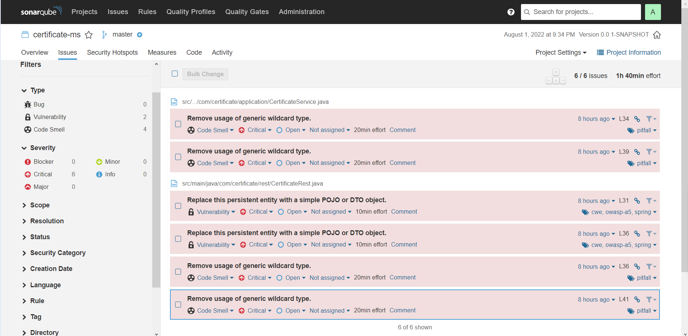
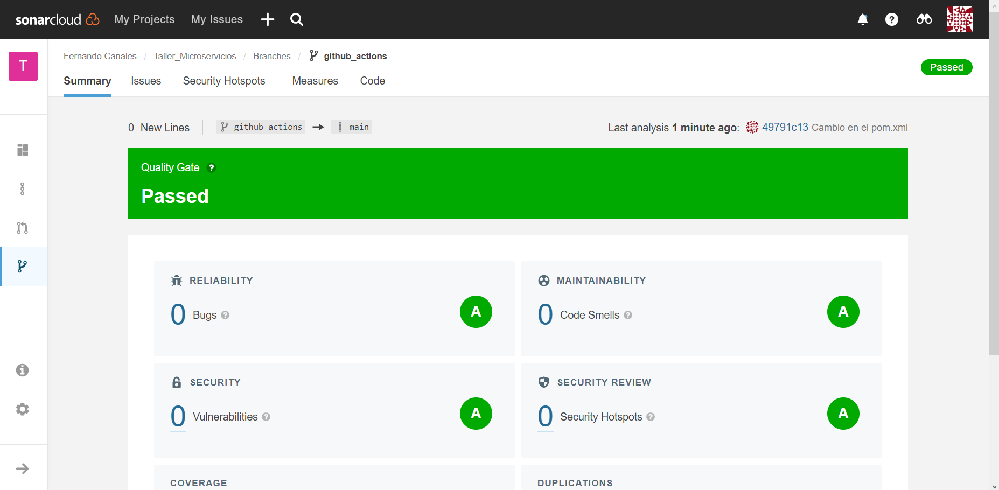

# Taller de Microservicios: Challenge 9

## Cómo usar

- Iniciar base de datos **MongoDB**.

- Iniciar el servicio desde un **IDE de preferencia**.

## SonarQube

- **Issues** generados por el proyecto.

- **Passed** en SonarCloud.

## Bibliografía

- __[Youtube - Cómo instalar SonarQube en Docker Containers](https://www.youtube.com/watch?v=gAcvCHMP1IM)__

- __[Github - quality-measurement](https://github.com/tasdemirbahadir/quality-measurement)__

- __[Linkedin - SonarQube & Jacoco configuration with SpringBoot and Maven/Gradle](https://www.linkedin.com/pulse/sonarqube-jacoco-configuration-springboot-maven-santosh-kumar-kar/)__

- __[SonarCloud Docs - Branch Analysis Setup](https://docs.sonarcloud.io/enriching/branch-analysis-setup/)__